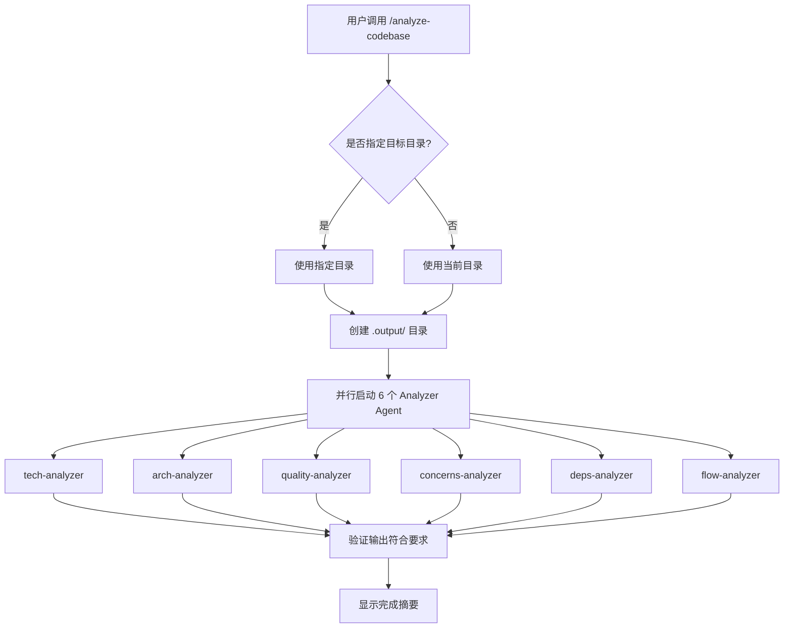

# Analyze Codebase

Claude Code 插件，使用并行 agent 分析代码库，生成 10 个独立 HTML 报告。

## 功能

自动分析目标代码库，输出以下 HTML 文档到 `.output/` 目录，可直接在浏览器中打开阅读：

| # | 文档 | 说明 |
|:--:|------|------|
| 1 | **STACK.html** | 技术栈（语言、框架、依赖） |
| 2 | **INTEGRATIONS.html** | 外部集成（API、数据库、服务） |
| 3 | **ARCHITECTURE.html** | 架构模式 |
| 4 | **STRUCTURE.html** | 代码结构 |
| 5 | **CONVENTIONS.html** | 编码规范 |
| 6 | **TESTING.html** | 测试模式 |
| 7 | **CONCERNS.html** | 问题与风险（含严重程度徽章） |
| 8 | **DEPENDENCIES.html** | 代码依赖 |
| 9 | **DATA-FLOW.html** | 数据流 |
| 10 | **FLOWCHARTS.html** | 流程图（Mermaid 交互式渲染） |

## Agent 组件

项目使用单一 Agent 文件 `agents/code-analyzer.md`，通过 `focus` 参数区分 6 个分析领域：

| focus | 功能 | 输出文档 |
|-------|------|----------|
| `tech` | 技术栈和集成 | STACK.html, INTEGRATIONS.html |
| `arch` | 架构和结构 | ARCHITECTURE.html, STRUCTURE.html |
| `quality` | 代码质量和测试 | CONVENTIONS.html, TESTING.html |
| `concerns` | 问题与风险 | CONCERNS.html |
| `deps` | 依赖分析 | DEPENDENCIES.html |
| `flow` | 数据流和流程图 | DATA-FLOW.html, FLOWCHARTS.html |

## 分析流程



## 安装

```bash
/plugin marketplace add yrzroger/code-analyzer
/plugin install analyze-codebase
/reload-plugins
```

## 使用

在任意项目目录下运行：

```
/analyze-codebase [可选：目标目录路径]
```

默认分析当前目录。


