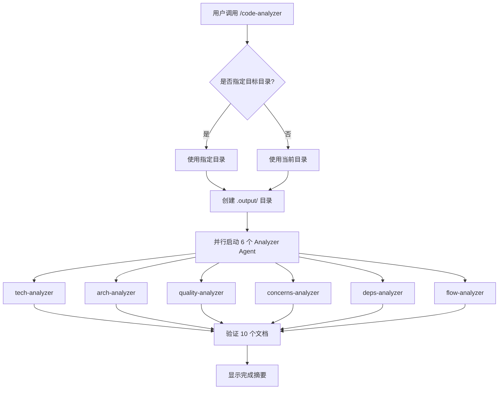

# Code Analyzer

Claude Code 插件，使用 6 个并行 agent 分析代码库，生成 10 个结构化文档。

## 功能

自动分析目标代码库，输出以下文档到 `.output/` 目录：

1. **STACK.md** - 技术栈（语言、框架、依赖）
2. **INTEGRATIONS.md** - 外部集成（API、数据库、服务）
3. **ARCHITECTURE.md** - 架构模式
4. **STRUCTURE.md** - 代码结构
5. **CONVENTIONS.md** - 编码规范
6. **TESTING.md** - 测试模式
7. **CONCERNS.md** - 问题与风险
8. **DEPENDENCIES.md** - 代码依赖
9. **DATA-FLOW.md** - 数据流
10. **FLOWCHARTS.md** - 流程图 (Mermaid)

## Agent 组件

项目包含 6 个分析 Agent，每个 Agent 由 Markdown 文件定义：

| Agent | 文件 | 功能 | 输出文档 |
|-------|------|------|----------|
| tech-analyzer | `agents/tech-analyzer.md` | 技术栈和集成 | STACK.md, INTEGRATIONS.md |
| arch-analyzer | `agents/arch-analyzer.md` | 架构和结构 | ARCHITECTURE.md, STRUCTURE.md |
| quality-analyzer | `agents/quality-analyzer.md` | 代码质量和测试 | CONVENTIONS.md, TESTING.md |
| concerns-analyzer | `agents/concerns-analyzer.md` | 问题与风险 | CONCERNS.md |
| deps-analyzer | `agents/deps-analyzer.md` | 依赖分析| DEPENDENCIES.md |
| flow-analyzer | `agents/flow-analyzer.md` | 数据流和流程图 | DATA-FLOW.md, FLOWCHARTS.md |

## 分析流程



## 安装

```bash
claude plugin install ./code-analyzer-plugin
```

或复制到插件目录：

```bash
cp -r code-analyzer-plugin ~/.claude/plugins/cache/claude-plugins-official/code-analyzer/1.0.0
```

## 使用

在任意项目目录下运行：

```
/code-analyzer [可选：目标目录路径]
```

默认分析当前目录。


