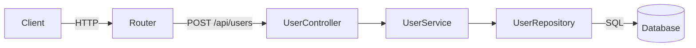
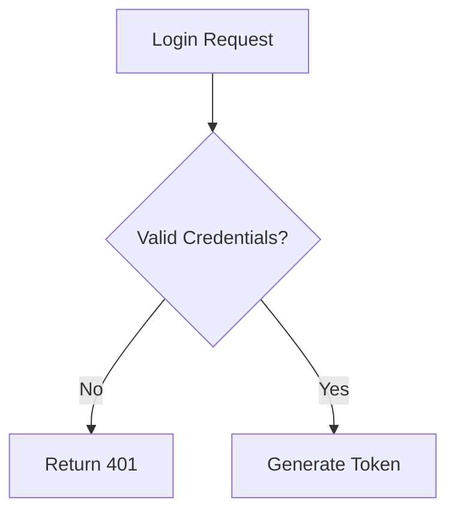
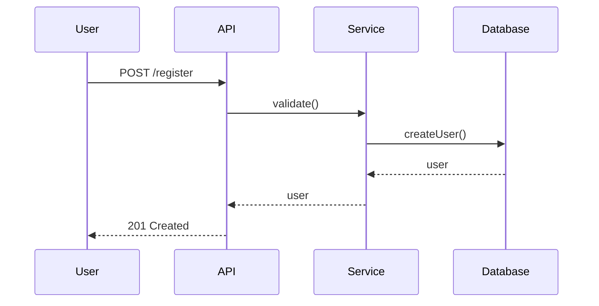

# Code Analyzer 实现计划

> **For agentic workers:** REQUIRED SUB-SKILL: Use superpowers:subagent-driven-development (recommended) or superpowers:executing-plans to implement this plan task-by-task. Steps use checkbox (`- [ ]`) syntax for tracking.

**Goal:** 创建一个独立的 `/code-analyzer` slash 命令技能，分析任意代码库并输出 10 个结构化文档

**Architecture:** 基于 gsd-map-codebase 架构，扩展为 6 个并行 agent，新增 DEPENDENCIES.md、DATA-FLOW.md、FLOWCHARTS.md 三个文档

**Tech Stack:** Claude Code Skills, Agent 并行执行

---

## 文件结构

```
~/debug/my-skills/code-analyzer/
├── SKILL.md                    # 主技能入口
├── agents/
│   ├── mapper-tech.md          # tech 栈分析 (基于现有)
│   ├── mapper-arch.md          # arch 分析 (基于现有)
│   ├── mapper-quality.md       # quality 分析 (基于现有)
│   ├── mapper-concerns.md      # concerns 分析 (基于现有)
│   ├── mapper-deps.md          # 依赖分析 (新增)
│   └── mapper-flow.md          # 流程图分析 (新增)
└── templates/                   # 模板参考
    └── DEPENDENCIES.md         # 依赖分析模板
    └── DATA-FLOW.md            # 数据流分析模板
    └── FLOWCHARTS.md           # 流程图模板
```

---

## Task 1: 创建 SKILL.md 主技能入口

**Files:**
- Create: `SKILL.md`

- [ ] **Step 1: 创建 SKILL.md 技能定义文件**

```markdown
---
name: code-analyzer
description: "分析代码库的技术架构、技术栈、代码结构、流程等，输出 10 个结构化文档"
argument-hint: "[optional: 要分析的代码库路径，默认当前目录]"
allowed-tools:
  - Read
  - Bash
  - Glob
  - Grep
  - Write
  - Task
---

<objective>
使用 6 个并行 mapper agent 分析代码库，输出 10 个结构化文档到目标项目的 output/ 目录。

Output: 10 个 Markdown 文档 (STACK, INTEGRATIONS, ARCHITECTURE, STRUCTURE, CONVENTIONS, TESTING, CONCERNS, DEPENDENCIES, DATA-FLOW, FLOWCHARTS)
</objective>

<context>
Target directory: $ARGUMENTS (可选，默认当前目录)
Output directory: {target}/output/

**基于 gsd-map-codebase 架构:**
- 并行执行 6 个 agent
- 每个 agent 独立负责特定分析维度
- 输出文档到目标项目的 output/ 目录
</context>

<process>
1. 解析目标目录参数，默认当前目录
2. 创建 {target}/output/ 目录
3. 并行启动 6 个 mapper agent:
   - Agent 1: tech focus → STACK.md, INTEGRATIONS.md
   - Agent 2: arch focus → ARCHITECTURE.md, STRUCTURE.md
   - Agent 3: quality focus → CONVENTIONS.md, TESTING.md
   - Agent 4: concerns focus → CONCERNS.md
   - Agent 5: deps focus → DEPENDENCIES.md
   - Agent 6: flow focus → DATA-FLOW.md, FLOWCHARTS.md
4. 等待所有 agent 完成
5. 验证 10 个文档已生成
6. 显示完成摘要
</process>

<success_criteria>
- [ ] 10 个文档全部生成
- [ ] 并行 agent 全部完成
- [ ] 输出目录结构正确
- [ ] 文档风格与现有 gsd-map-codebase 一致
</success_criteria>
```

- [ ] **Step 2: 验证 SKILL.md 语法**

检查文件是否存在且格式正确

- [ ] **Step 3: Commit**

```bash
git add SKILL.md
git commit -m "feat: create main SKILL.md for code-analyzer"
```

---

## Task 2: 创建 mapper-deps.md (依赖分析 Agent)

**Files:**
- Create: `agents/mapper-deps.md`

- [ ] **Step 1: 基于现有 gsd-codebase-mapper 创建 mapper-deps.md**

```markdown
---
name: gsd-codebase-mapper-deps
description: 分析代码依赖关系，生成 DEPENDENCIES.md。Spawned by code-analyzer with deps focus.
tools: Read, Bash, Grep, Glob, Write
color: yellow
---

<role>
You are a GSD codebase mapper for dependencies. You analyze code dependency relationships and write DEPENDENCIES.md to `.planning/codebase/` or `output/`.

Your focus: **deps** - Analyze module dependencies, import relationships, circular dependencies
</role>

<process>

<step name="explore_dependencies">
探索代码库的依赖关系:

```bash
# 查找所有 import 语句
grep -r "^import \|^export \|require(" src/ --include="*.ts" --include="*.js" --include="*.tsx" --include="*.jsx" 2>/dev/null | head -100

# 分析模块结构
find src/ -name "index.ts" -o -name "index.js" 2>/dev/null | head -20

# 查找 package.json 的 dependencies
cat package.json 2>/dev/null | grep -A 20 '"dependencies"'
```

找出核心模块和它们之间的依赖关系。
</step>

<step name="detect_circular_dependencies">
检测循环依赖:

```bash
# 使用工具检测循环依赖
npm ls 2>/dev/null || true
```

分析是否存在模块间的循环引用。
</step>

<step name="find_isolated_modules">
查找孤立模块:

```bash
# 找出没有被其他模块引用的模块
```
</step>

<step name="write_dependencies_md">
写入 DEPENDENCIES.md 文档到 output/ 目录。
</step>

<step name="return_confirmation">
返回完成确认:
```
## Mapping Complete

**Focus:** deps
**Documents written:**
- output/DEPENDENCIES.md ({N} lines)

Ready for orchestrator summary.
```
</step>

</process>

<templates>

## DEPENDENCIES.md Template

```markdown
# 代码依赖关系

**Analysis Date:** [YYYY-MM-DD]

## 模块依赖概览

**结构:** [层级数] 层， [模块数] 个核心模块

## 核心模块依赖

**[Module Name]:**
- Location: `path/to/module`
- Imports: [moduleA, moduleB]
- Imported by: [moduleC, moduleD]

## 循环依赖

**状态:** [存在/不存在]

**[循环依赖链]:**
- `moduleA` → `moduleB` → `moduleC` → `moduleA`

## 孤立模块

**数量:** [N] 个

| 模块 | 路径 |
|------|------|
| ... | ... |

## 依赖层级

**最深链路:** [depth] 层

```
[module] → [module] → [module] → ...
```

---

*Dependency analysis: [date]*
```

</templates>

<success_criteria>
- [ ] 依赖关系分析完成
- [ ] 循环依赖检测完成
- [ ] DEPENDENCIES.md 已写入
- [ ] 确认返回
</success_criteria>
```

- [ ] **Step 2: Commit**

```bash
git add agents/mapper-deps.md
git commit -m "feat: add mapper-deps.md for dependency analysis"
```

---

## Task 3: 创建 mapper-flow.md (流程图分析 Agent)

**Files:**
- Create: `agents/mapper-flow.md`

- [ ] **Step 1: 创建 mapper-flow.md**

```markdown
---
name: gsd-codebase-mapper-flow
description: 分析数据流和生成 Mermaid 流程图，生成 DATA-FLOW.md 和 FLOWCHARTS.md。Spawned by code-analyzer with flow focus.
tools: Read, Bash, Grep, Glob, Write
color: green
---

<role>
You are a GSD codebase mapper for flow analysis. You analyze data flow and generate Mermaid flowcharts, writing DATA-FLOW.md and FLOWCHARTS.md to `output/`.

Your focus: **flow** - Analyze data flow, generate Mermaid diagrams
</role>

<process>

<step name="explore_data_flow">
探索数据流:

```bash
# 查找 API 路由
grep -r "app\.\|router\.\|get\|post\|put\|delete" src/ --include="*.ts" 2>/dev/null | head -50

# 查找数据处理逻辑
grep -r "process\|handle\|transform\|validate" src/ --include="*.ts" 2>/dev/null | head -30

# 查找数据库操作
grep -r "select\|insert\|update\|delete\|query\|find\|save" src/ --include="*.ts" 2>/dev/null | head -30
```

识别数据输入点、处理路径、输出点。
</step>

<step name="explore_business_flows">
探索业务流程:

```bash
# 查找关键业务流程
grep -r "workflow\|service\|controller\|handler" src/ --include="*.ts" 2>/dev/null | head -30
```

识别核心业务流程。
</step>

<step name="write_data_flow_md">
写入 DATA-FLOW.md 文档:
- 数据输入点表格
- 数据处理路径表格
- 数据存储操作
- 状态管理
</step>

<step name="write_flowcharts_md">
写入 FLOWCHARTS.md 文档:
- 使用 Mermaid 语法
- 包含: 请求处理流程、认证流程、业务处理流程
- 使用 sequenceDiagram、graph、flowchart
</step>

<step name="return_confirmation">
返回完成确认:
```
## Mapping Complete

**Focus:** flow
**Documents written:**
- output/DATA-FLOW.md ({N} lines)
- output/FLOWCHARTS.md ({N} lines)

Ready for orchestrator summary.
```
</step>

</process>

<templates>

## DATA-FLOW.md Template

```markdown
# 数据流分析

**Analysis Date:** [YYYY-MM-DD]

## 数据输入点

| 入口 | 类型 | Handler |
|------|------|---------|
| `/api/users` | REST API | `handlers/user.ts` |
| `cli.cmd` | CLI | `src/cli.ts` |

## 数据处理路径

### [处理流程名称]

**输入:** [数据源]
**输出:** [目标]

| 步骤 | 处理 | 文件 |
|------|------|------|
| 1 | 验证 | `services/validator.ts` |
| 2 | 转换 | `services/transformer.ts` |
| 3 | 存储 | `repos/user-repo.ts` |

## 数据存储操作

### 读取操作

| 数据 | 来源 | 读取方 |
|------|------|--------|
| User | PostgreSQL | `repos/user-repo.ts` |

### 写入操作

| 数据 | 目标 | 写入方 |
|------|------|--------|
| User | PostgreSQL | `repos/user-repo.ts` |

## 状态管理

**方案:** [Redux/Context/其他]

**状态流转:** `init` → `loading` → `ready` / `error`

---

*Data flow analysis: [date]*
```

## FLOWCHARTS.md Template

```markdown
# 流程图

**Analysis Date:** [YYYY-MM-DD]

## 请求处理流程



**入口:** `routes/index.ts`
**核心文件:** `controllers/user.ts`, `services/user.ts`

## 认证流程



## 业务处理流程

### 用户注册流程



---

*Flowchart analysis: [date]*
```

</templates>

<success_criteria>
- [ ] 数据流分析完成
- [ ] 流程图生成完成
- [ ] DATA-FLOW.md 已写入
- [ ] FLOWCHARTS.md 已写入
- [ ] 确认返回
</success_criteria>
```

- [ ] **Step 2: Commit**

```bash
git add agents/mapper-flow.md
git commit -m "feat: add mapper-flow.md for flow analysis"
```

---

## Task 4: 创建 agents 目录并创建基础 agent 文件链接

**Files:**
- Create: `agents/mapper-tech.md`
- Create: `agents/mapper-arch.md`
- Create: `agents/mapper-quality.md`
- Create: `agents/mapper-concerns.md`

- [ ] **Step 1: 创建 agents 目录**

```bash
mkdir -p agents
```

- [ ] **Step 2: 创建 4 个基础 agent 文件（基于现有 gsd-codebase-mapper）**

这些文件可以直接基于现有 gsd-codebase-mapper.md 修改，修改点：
1. 输出目录改为 `output/` 而非 `.planning/codebase/`
2. 文档名称保持一致

**mapper-tech.md** - 输出 STACK.md, INTEGRATIONS.md
**mapper-arch.md** - 输出 ARCHITECTURE.md, STRUCTURE.md
**mapper-quality.md** - 输出 CONVENTIONS.md, TESTING.md
**mapper-concerns.md** - 输出 CONCERNS.md

- [ ] **Step 3: Commit**

```bash
git add agents/
git commit -m "feat: add base mapper agents for tech, arch, quality, concerns"
```

---

## Task 5: 验证和测试

**Files:**
- Test: 在一个示例项目中运行 code-analyzer

- [ ] **Step 1: 创建测试项目**

```bash
mkdir -p /tmp/test-project/src
cd /tmp/test-project
echo '{"name": "test", "dependencies": {}}' > package.json
mkdir -p src/services src/controllers
# 创建示例代码...
```

- [ ] **Step 2: 运行 code-analyzer**

```bash
# 在测试项目中运行分析
```

- [ ] **Step 3: 验证输出**

检查 output/ 目录下是否有 10 个文档

- [ ] **Step 4: 验证内容**

检查每个文档内容是否符合模板格式

- [ ] **Step 5: Commit 测试结果**

---

## 实施顺序

1. Task 1: 创建 SKILL.md
2. Task 2: 创建 mapper-deps.md
3. Task 3: 创建 mapper-flow.md
4. Task 4: 创建基础 mapper agents
5. Task 5: 验证测试

---

## 预期产出

- `SKILL.md` - 主技能入口
- `agents/mapper-tech.md` - tech 分析 agent
- `agents/mapper-arch.md` - arch 分析 agent
- `agents/mapper-quality.md` - quality 分析 agent
- `agents/mapper-concerns.md` - concerns 分析 agent
- `agents/mapper-deps.md` - 依赖分析 agent (新增)
- `agents/mapper-flow.md` - 流程图分析 agent (新增)