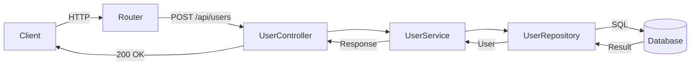
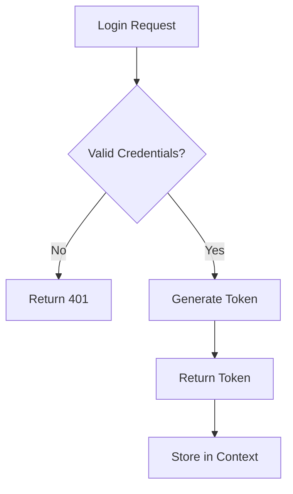
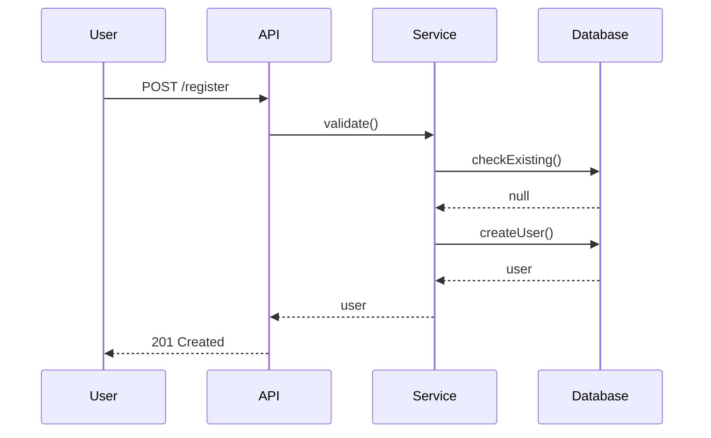

# Code Analyzer 技能设计

**Created:** 2026-05-11
**Based on:** gsd-map-codebase
**Author:** roger_yu

---

## 概述

创建一个独立的 slash 命令技能 `/code-analyzer`，用于分析任意代码库的技术架构、技术栈、代码结构、流程等。

**输出位置:** 目标代码库的 `./output/` 目录

---

## 技能结构

```
~/debug/my-skills/code-analyzer/
├── SKILL.md              # 技能定义
└── agents/
    ├── mapper-tech.md    # Agent: tech 栈分析
    ├── mapper-arch.md    # Agent: 架构分析
    ├── mapper-quality.md # Agent: 质量分析
    ├── mapper-concerns.md# Agent: 问题分析
    ├── mapper-deps.md    # Agent: 依赖分析（新增）
    └── mapper-flow.md    # Agent: 流程图分析（新增）
```

---

## 输出文档 (10 个)

| # | 文档 | Agent | 内容 |
|---|------|-------|------|
| 1 | STACK.md | tech | 技术栈、语言、运行时、依赖 |
| 2 | INTEGRATIONS.md | tech | 外部服务、API、存储、CI/CD |
| 3 | ARCHITECTURE.md | arch | 架构模式、分层、数据流 |
| 4 | STRUCTURE.md | arch | 目录结构、命名规范 |
| 5 | CONVENTIONS.md | quality | 编码规范、代码风格 |
| 6 | TESTING.md | quality | 测试框架、模式、Mock |
| 7 | CONCERNS.md | concerns | 技术债务、安全、性能 |
| 8 | DEPENDENCIES.md | deps (new) | 代码依赖关系、循环依赖 |
| 9 | DATA-FLOW.md | flow (new) | 数据输入→处理→输出路径 |
| 10 | FLOWCHARTS.md | flow (new) | Mermaid 流程图 |

---

## 并行执行设计

```
Orchestrator (SKILL.md)
    ├── Agent 1: tech    → STACK.md, INTEGRATIONS.md
    ├── Agent 2: arch    → ARCHITECTURE.md, STRUCTURE.md
    ├── Agent 3: quality → CONVENTIONS.md, TESTING.md
    ├── Agent 4: concerns→ CONCERNS.md
    ├── Agent 5: deps    → DEPENDENCIES.md (new)
    └── Agent 6: flow    → DATA-FLOW.md, FLOWCHARTS.md (new)
```

---

## 新增文档详细设计

### DEPENDENCIES.md

```markdown
# 代码依赖关系

**Analysis Date:** [YYYY-MM-DD]

## 模块依赖概览

**结构:** [层级数] 层， [模块数] 个核心模块

## 核心模块依赖

**[Module Name]:**
- Location: `path/to/module`
- Imports: [moduleA, moduleB]
- Imported by: [moduleC, moduleD]

## 循环依赖

**状态:** [存在/不存在]

**[循环依赖链]:**
- `moduleA` → `moduleB` → `moduleC` → `moduleA`

## 孤立模块

**数量:** [N] 个

| 模块 | 路径 |
|------|------|
| ... | ... |

## 依赖层级

**最深链路:** [depth] 层

```
[module] → [module] → [module] → ...
```

---

*Dependency analysis: [date]*
```

### DATA-FLOW.md

```markdown
# 数据流分析

**Analysis Date:** [YYYY-MM-DD]

## 数据输入点

| 入口 | 类型 | Handler |
|------|------|---------|
| `/api/users` | REST API | `handlers/user.ts` |
| `cli.cmd` | CLI | `src/cli.ts` |

## 数据处理路径

### [处理流程名称]

**输入:** [数据源]
**输出:** [目标]

| 步骤 | 处理 | 文件 |
|------|------|------|
| 1 | 验证 | `services/validator.ts` |
| 2 | 转换 | `services/transformer.ts` |
| 3 | 存储 | `repos/user-repo.ts` |

## 数据存储操作

### 读取操作

| 数据 | 来源 | 读取方 |
|------|------|--------|
| User | PostgreSQL | `repos/user-repo.ts` |

### 写入操作

| 数据 | 目标 | 写入方 |
|------|------|--------|
| User | PostgreSQL | `repos/user-repo.ts` |

## 状态管理

**方案:** [Redux/Context/其他]

**状态流转:** `init` → `loading` → `ready` / `error`

---

*Data flow analysis: [date]*
```

### FLOWCHARTS.md

```markdown
# 流程图

**Analysis Date:** [YYYY-MM-DD]

## 请求处理流程



**入口:** `routes/index.ts`
**核心文件:** `controllers/user.ts`, `services/user.ts`, `repos/user.ts`

## 认证流程



## 业务处理流程

### 用户注册流程



---

*Flowchart analysis: [date]*
```

---

## 输出结构

```
target-project/
└── output/
    ├── STACK.md
    ├── INTEGRATIONS.md
    ├── ARCHITECTURE.md
    ├── STRUCTURE.md
    ├── CONVENTIONS.md
    ├── TESTING.md
    ├── CONCERNS.md
    ├── DEPENDENCIES.md      # 新增
    ├── DATA-FLOW.md         # 新增
    └── FLOWCHARTS.md        # 新增
```

---

## 使用方式

```bash
# 分析当前目录
/code-analyzer

# 分析指定目录
/code-analyzer /path/to/project
```

---

## 继承自 gsd-map-codebase

- 并行 6 个 agent 执行
- 使用 gsd-codebase-mapper 作为基础 agent 模板
- 输出风格与现有 7 个文档一致
- 复用现有探索命令模板

---

## 待实现

- [ ] SKILL.md - 主技能入口
- [ ] agents/mapper-tech.md - tech 分析
- [ ] agents/mapper-arch.md - arch 分析
- [ ] agents/mapper-quality.md - quality 分析
- [ ] agents/mapper-concerns.md - concerns 分析
- [ ] agents/mapper-deps.md - 依赖分析（新增）
- [ ] agents/mapper-flow.md - 流程图分析（新增）