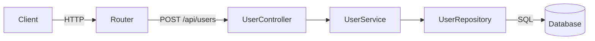
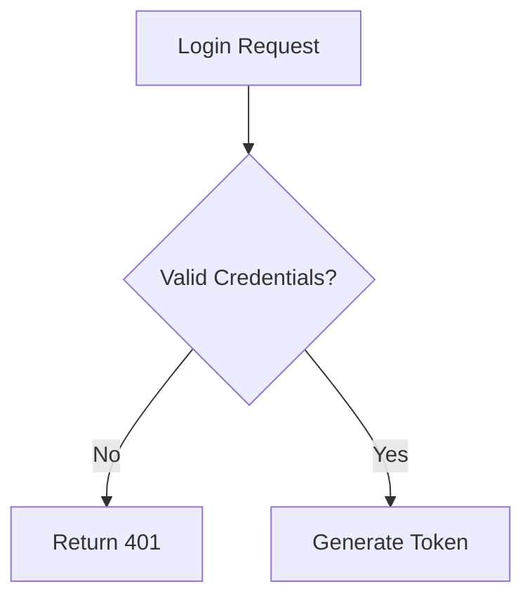
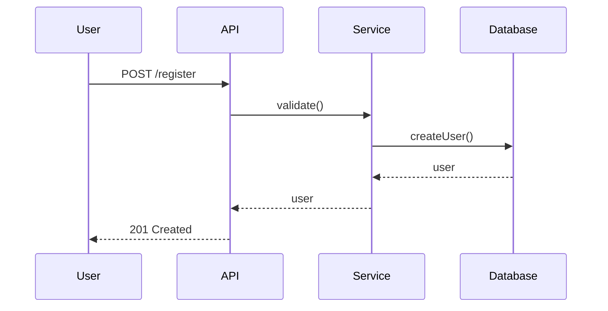

# 流程图

**Analysis Date:** [YYYY-MM-DD]

## 请求处理流程

```mermaid
graph LR
    A[Client] -->|HTTP| B[Router]
    B -->|POST /api/users| C[UserController]
    C --> D[UserService]
    D --> E[UserRepository]
    E -->|SQL| F[(Database)]
```

**入口:** `routes/index.ts`
**核心文件:** `controllers/user.ts`, `services/user.ts`

## 认证流程

```mermaid
flowchart TD
    A[Login Request] --> B{Valid Credentials?}
    B -->|No| C[Return 401]
    B -->|Yes| D[Generate Token]
```

## 业务处理流程

### 用户注册流程

```mermaid
sequenceDiagram
    participant U as User
    participant A as API
    participant S as Service
    participant DB as Database

    U->>A: POST /register
    A->>S: validate()
    S->>DB: createUser()
    DB-->>S: user
    S-->>A: user
    A-->>U: 201 Created
```

---

*Flowchart analysis: [date]*